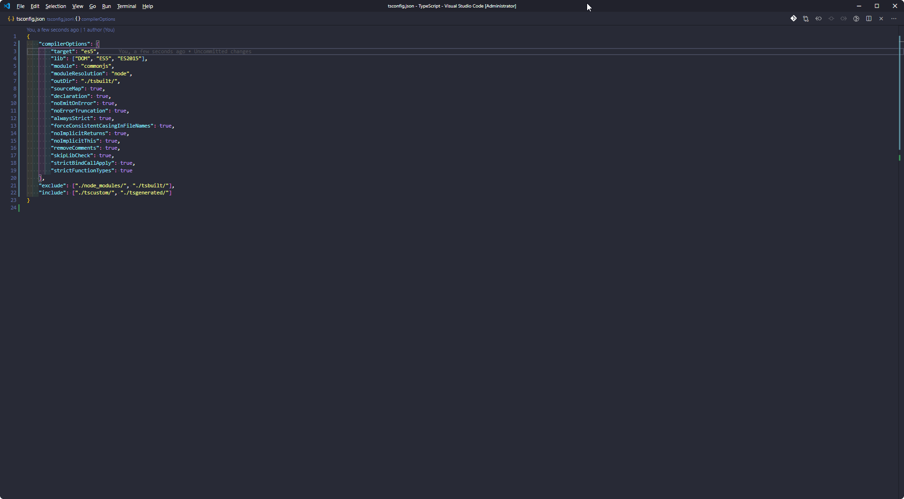

## Configuration

I have a configuration to get it more like VisualStudio, explorers and stuff to the right, statusbar hidden etc.

```json
  /*
   *   Silence the noise
   */
  "workbench.activityBar.visible": false,
  "workbench.editor.showTabs": false,
  "workbench.sideBar.location": "right",
  "workbench.statusBar.visible": false,
  "editor.minimap.enabled": false
```

That is helping me to get a clean working environment.



To now get the needed windows back (explorer, git etc.), there are some keybindings.

```json
[
  /**
   * Activity Bar
   **/
  {
    "key": "ctrl+k ctrl+e",
    "command": "workbench.view.explorer"
  },
  {
    "key": "ctrl+k ctrl+g",
    "command": "workbench.view.scm"
  },
  {
    "key": "ctrl+k ctrl+d",
    "command": "workbench.view.debug"
  },
  {
    "key": "ctrl+k ctrl+x",
    "command": "workbench.extensions.action.showInstalledExtensions"
  },
  {
    "key": "ctrl+k ctrl+b",
    "command": "workbench.action.toggleSidebarVisibility"
  }
]
```

## GIT

To make VS Code your default for everything git-related, first you need to ensure you can run VS Code from the command-line as outlined in the Prerequisite section.

Then, run the command git config --global -e to edit the global config, and add the following:

```bash
[core]
  editor = code --wait
[diff]
  tool = vscode
[difftool "vscode"]
  cmd = code --wait --diff $LOCAL $REMOTE
[merge]
  tool = vscode
[mergetool "vscode"]
  cmd = code --wait $MERGED
```

- [VS Code: Let's git it on](https://dev.to/robole/vs-code-let-s-git-it-on-24bd)

## Plugins

- [Auto Import](https://marketplace.visualstudio.com/items?itemName=steoates.autoimport)
  - _Automatically finds, parses and provides code actions and code completion for all available imports. Works with Typescript and TSX._
- [Better Comments](https://marketplace.visualstudio.com/items?itemName=aaron-bond.better-comments)
  - _The Better Comments extension will help you create more human-friendly comments in your code._
- [Bracket Pair Colorizer](https://marketplace.visualstudio.com/items?itemName=CoenraadS.bracket-pair-colorizer)
  - _This extension allows matching brackets to be identified with colours. The user can define which characters to match, and which colours to use._
- [Dracula Theme](https://marketplace.visualstudio.com/items?itemName=dracula-theme.theme-dracula)
- [EditorConfig for VS Code](https://marketplace.visualstudio.com/items?itemName=EditorConfig.EditorConfig)
  - _This plugin attempts to override user/workspace settings with settings found in .editorconfig files. No additional or vscode-specific files are required. As with any EditorConfig plugin, if root=true is not specified, EditorConfig will continue to look for an .editorconfig file outside of the project._
- [ESLint](https://marketplace.visualstudio.com/items?itemName=dbaeumer.vscode-eslint)
  - _Find and fix problems in your JavaScript code_
- [GitLens - Git supercharged](https://marketplace.visualstudio.com/items?itemName=eamodio.gitlens)
  - _GitLens supercharges the Git capabilities built into Visual Studio Code. It helps you to visualize code authorship at a glance via Git blame annotations and code lens, seamlessly navigate and explore Git repositories, gain valuable insights via powerful comparison commands, and so much more._
- [indent-rainbow](https://marketplace.visualstudio.com/items?itemName=oderwat.indent-rainbow)
  - _This extension colorizes the indentation in front of your text alternating four different colors on each step. Some may find it helpful in writing code for Nim or Python._
- [Material icon theme](https://marketplace.visualstudio.com/items?itemName=PKief.material-icon-theme)
- [NPM intellisense](https://marketplace.visualstudio.com/items?itemName=christian-kohler.npm-intellisense)
  - _Visual Studio Code plugin that autocompletes npm modules in import statements._
- [Path intellisense](https://marketplace.visualstudio.com/items?itemName=christian-kohler.path-intellisense)
  - _Visual Studio Code plugin that autocompletes filenames._
- [Prettier - Code formatter](https://marketplace.visualstudio.com/items?itemName=esbenp.prettier-vscode)
  - _Prettier is an opinionated code formatter. It enforces a consistent style by parsing your code and re-printing it with its own rules that take the maximum line length into account, wrapping code when necessary._
- [Settings sync](https://marketplace.visualstudio.com/items?itemName=Shan.code-settings-sync)
  - _Synchronize Settings, Snippets, Themes, File Icons, Launch, Keybindings, Workspaces and Extensions Across Multiple Machines Using GitHub Gist._
- [TabNine](https://marketplace.visualstudio.com/items?itemName=TabNine.tabnine-vscode)
  - _All-language autocompleter — TabNine uses machine learning to help you write code faster._
- [Visual Studio IntelliCode](https://marketplace.visualstudio.com/items?itemName=VisualStudioExptTeam.vscodeintellicode)
  - _The Visual Studio IntelliCode extension provides AI-assisted development features for Python, TypeScript/JavaScript and Java developers in Visual Studio Code, with insights based on understanding your code context combined with machine learning._
